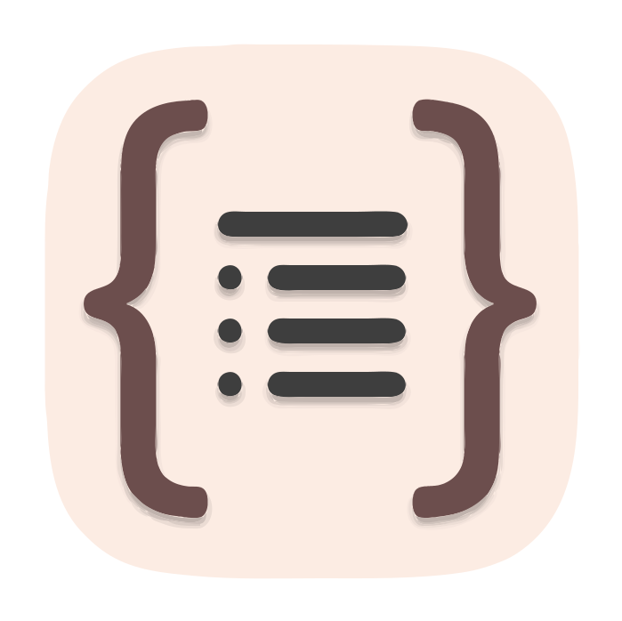
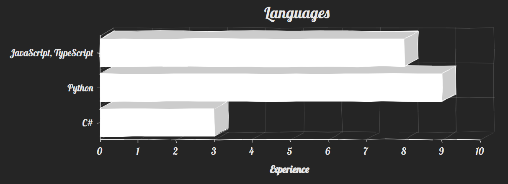

## Hi. I'm full stack developer.

<table>
    <tr>
    </tr>
    <tr>
        <td>Languages, technologies and tools:</td>
    </tr>
    <tr>
        <td>
            <!--  -->
            <!--  -->
            
            
            
            
            <!--  -->
            
            
            
            
            
            
            <!--  -->
            
            
            
            
            
            
            
            
        </td>
    </tr>
</table>
<table>
    <td>
        
    </td>
</table>

<table style="width:100%">
    <tr>
        <th>
            <h2>Connect with me:</h2>
        </th>
        <th>
            <h2>Portfolio:</h2>
        </th>
    </tr>
    <tr>
        <td>
            
            
        </td>
        <td>
            
        </td>
    </tr>
</table>