

  

<h3>Hi there </h3>

    
<b><g-emoji alias="books">📚</g-emoji>&nbsp;Current stack</b>

    
    
    

    
<b><g-emoji alias="hammer and wrench">🛠️</g-emoji>&nbsp;Languages and Tools</b>

    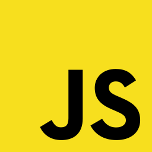
    
    
    
    
    
    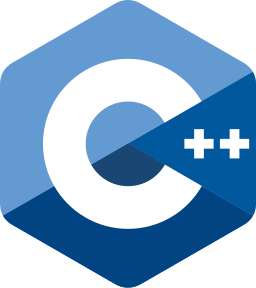
    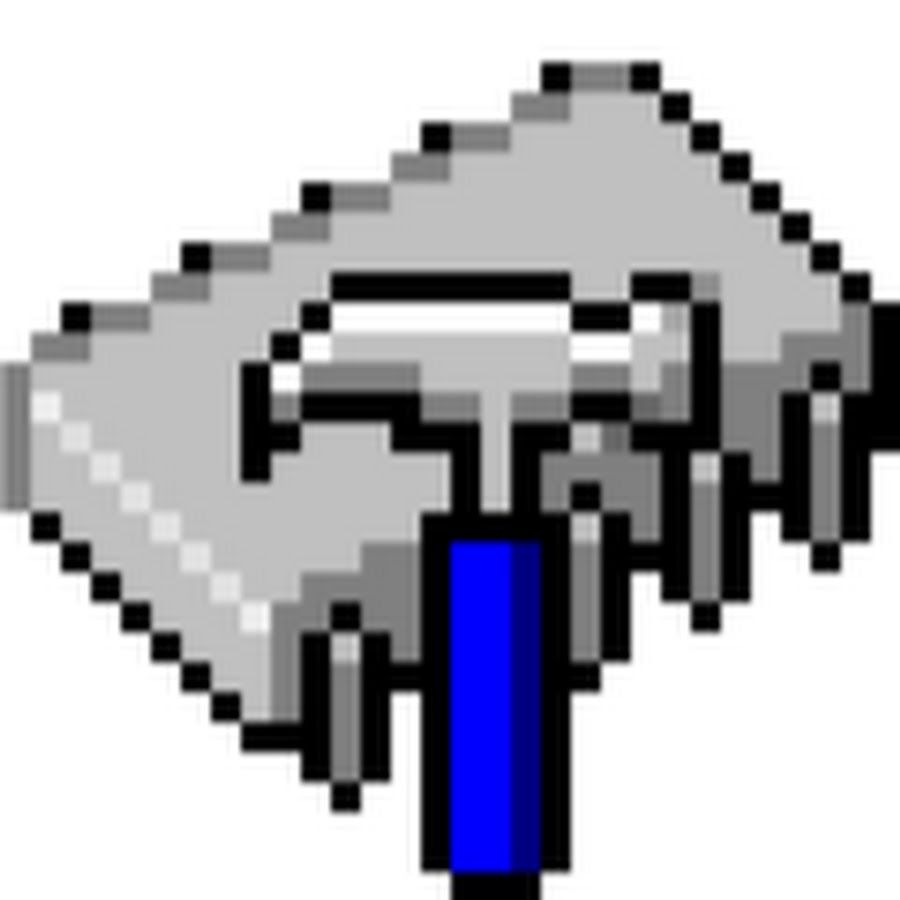
    
    <!--  -->
    
    
    
    
    
    
    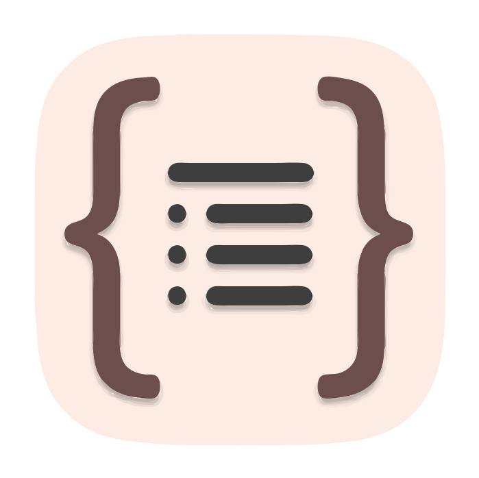
    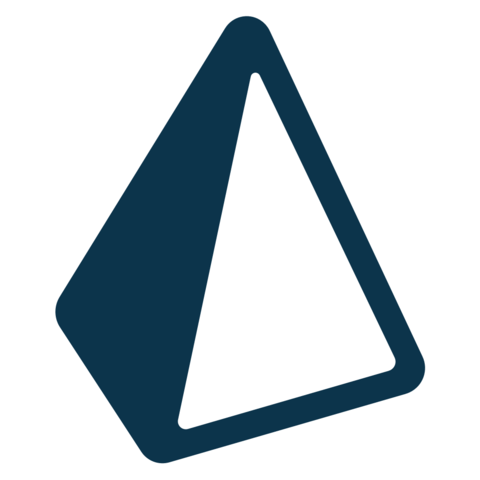
    
    
    
    
    
    
    
    
    
    
    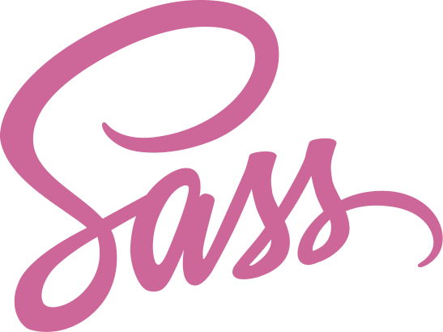
    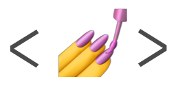
    
    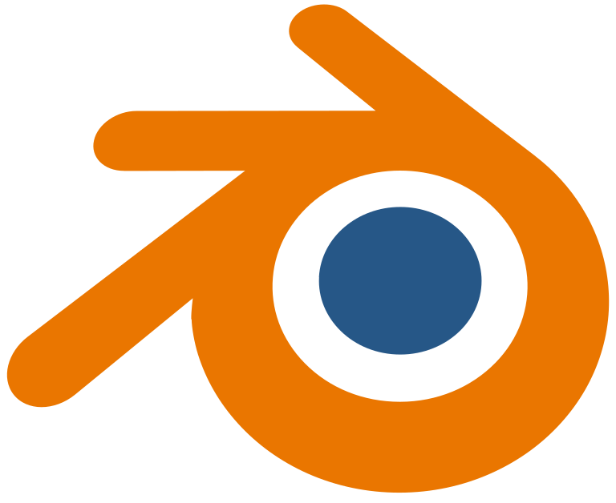
    <!-- 
    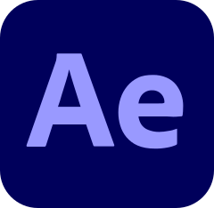
     -->
    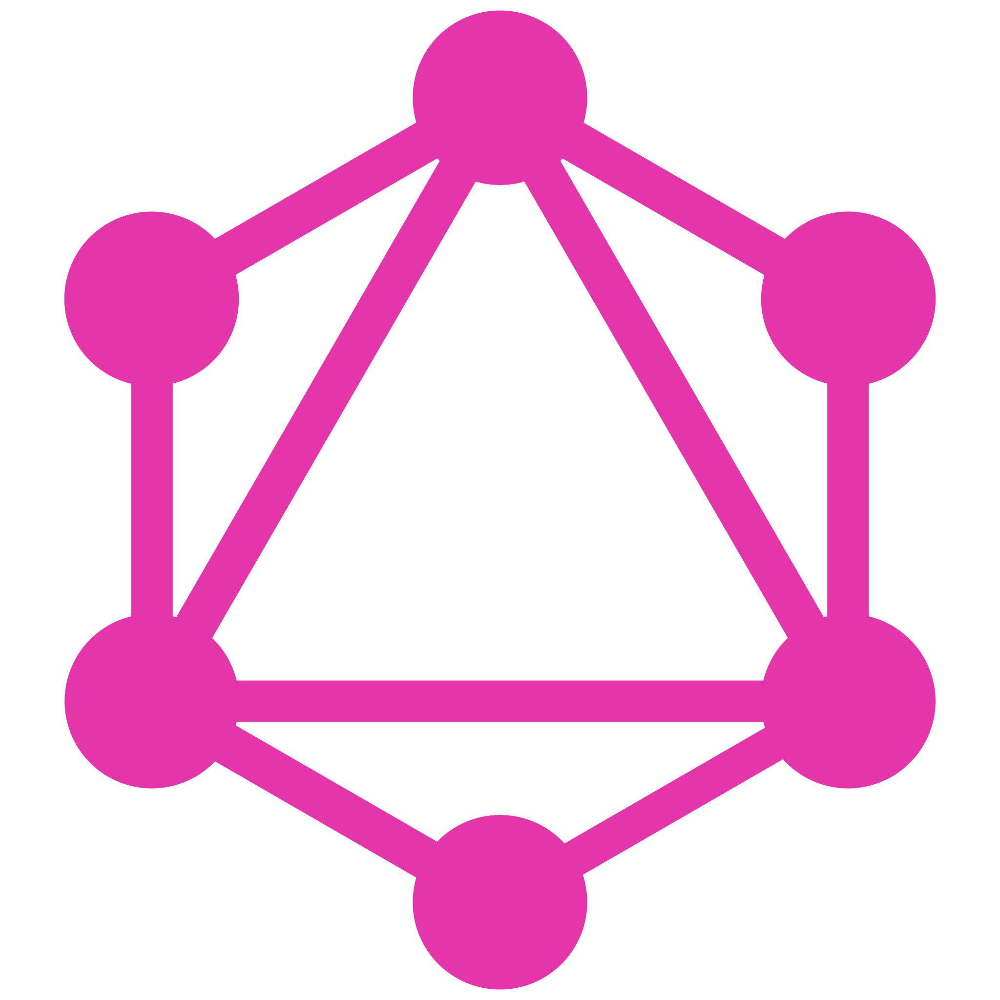
    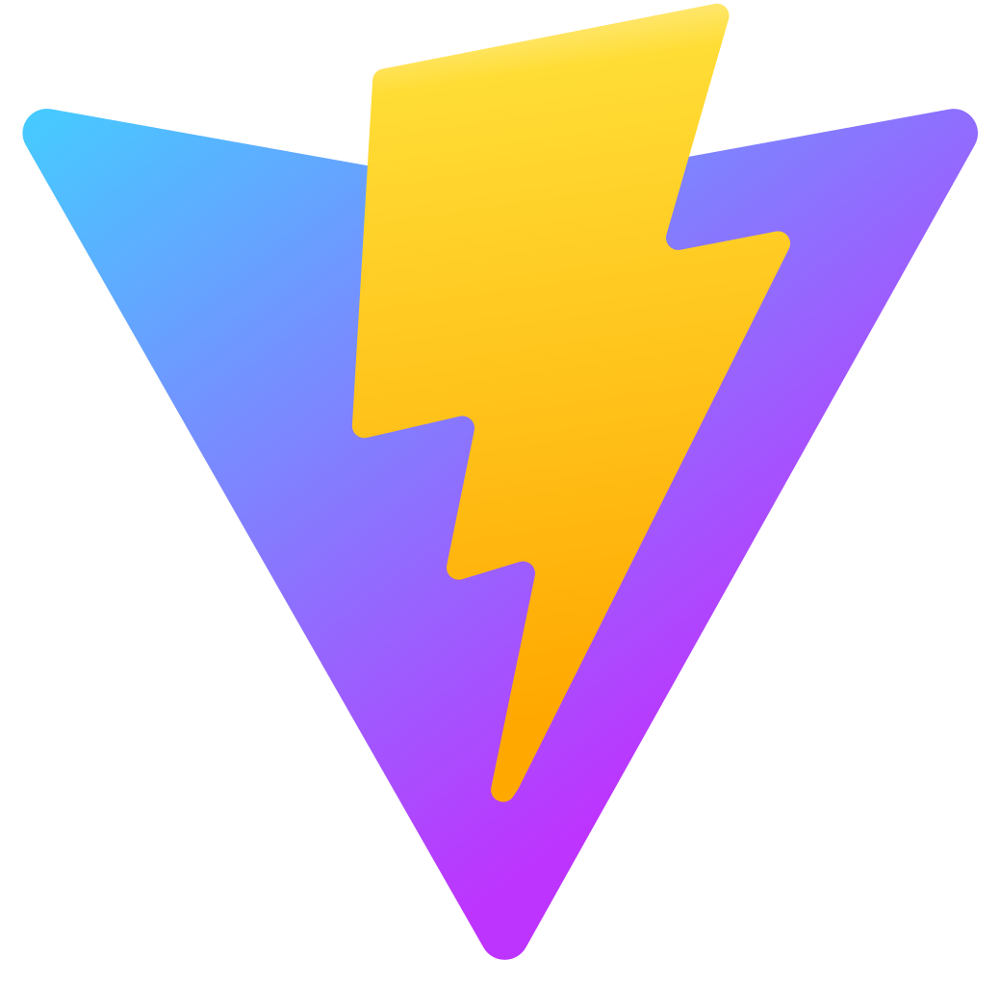
    
    
    
    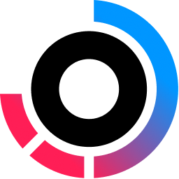
    
    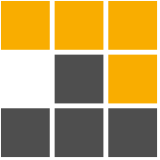
    
    
    
    
    
    

<g-emoji alias="link" >🔗</g-emoji>&nbsp;<strong>Look also at my portfolio</strong>

    <a target="_blank" href="https://hirontez.github.io/portfolio">
        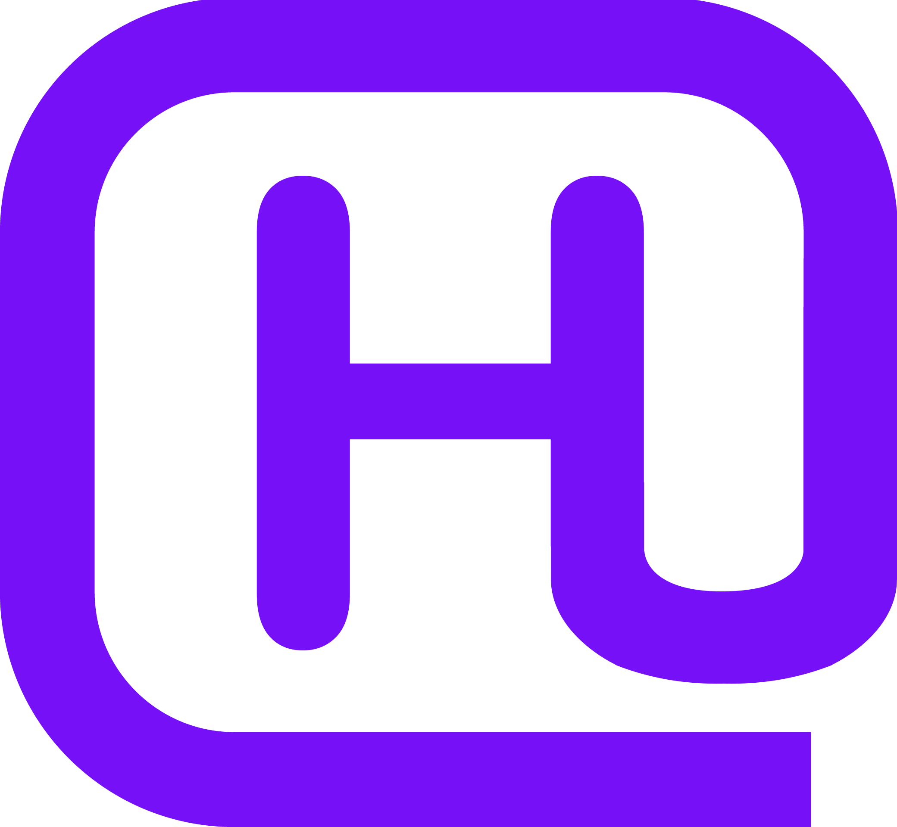
    </a>

