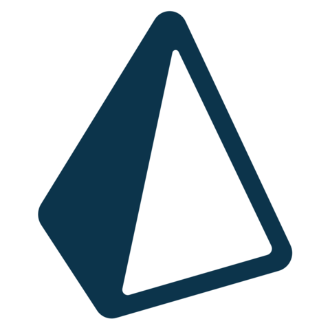
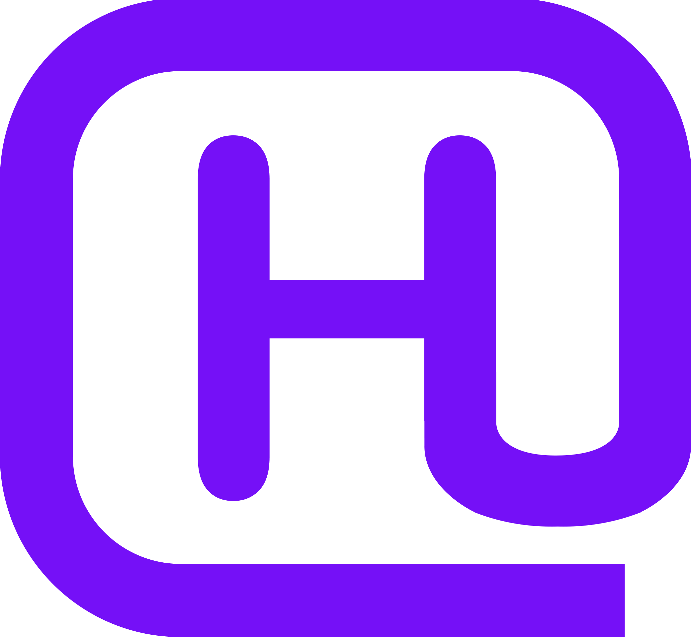

  

<h3>Hi there . I'm IT developer.</h3>

    
<b><g-emoji class="g-emoji" alias="hammer_and_wrench" fallback-src="./.assets/tools.png">🛠️</g-emoji>&nbsp;Languages and Tools</b>

    
    
    
    
    
    
    
    
    
    
    
    
    
    
    
    
    
    
    
    
    <!--  -->
    
    
    
    
    
    
    
    
    
    
    
    
    
    
    
    
    
    
    

<g-emoji class="g-emoji" alias="link" fallback-src="./.assets/link.png">🔗</g-emoji>&nbsp;<strong>Look also at my portfolio</strong>

    

